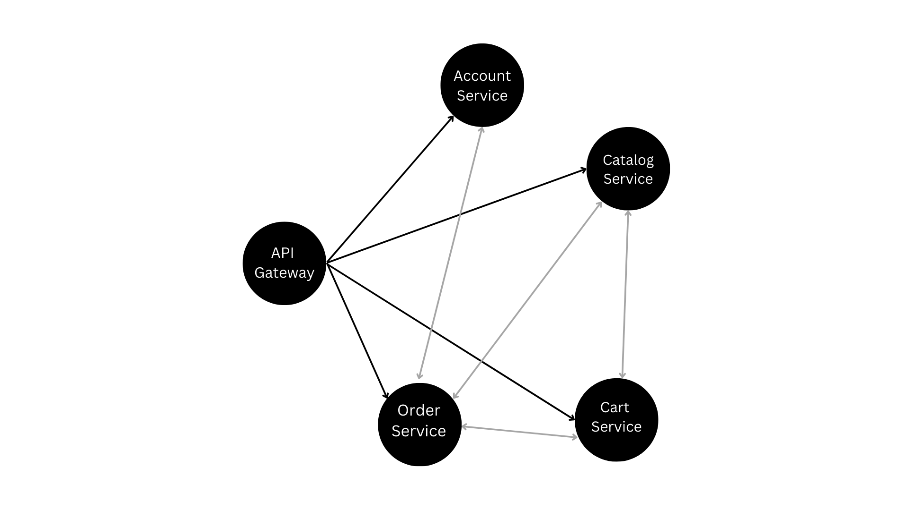

# E-commerce Microservices

This project is an advanced e-commerce platform designed using a microservices architecture ensuring **Scability**, **Reliability** and **Avoiding Single Point of Failure**. The services communicate with each other using **gRPC** which uses **Protobufs**, ensuring efficient and high-performance interactions. The primary services include account, catalog, order, cart, and an API gateway for routing requests to the appropriate services.


## Project Structure

- `account`: Manages user accounts and addresses.
- `catalog`: Manages product catalog.
- `order`: Manages orders and order processing.
- `cart`: Manages user shopping carts.
- `gateway`: API Gateway for routing requests to appropriate services.

## Technologies Used

- **Go**: Programming language used for implementing the services.
- **gRPC**: Communication protocol between microservices.
- **PostgreSQL**: Database used for storing data.
- **Protocol Buffers**: Used for defining gRPC services.
- **Elasticsearch**: Used for searching products.
- **Docker**: Containerization of services.
- **AWS EC2**: Deployment of services.
- **Nginx**: To Secure Server with HTTPS and Reverse proxy To API Gateway.

## Prerequisites

- Docker
## Setup

1. **Clone the repository**:
    ```sh
    git clone https://github.com/Sumitk99/ecom_microservices.git
    cd ecom_microservices
    ```

2. **Run PostgreSQL**:
    ```sh
    docker run --name postgres -e POSTGRES_PASSWORD=yourpassword -d -p 5432:5432 postgres
    ```

3. **Set up environment variables**:
   Create a `.env` file in the root directory and add the following:
    ```env
    POSTGRES_USER=yourusername
    POSTGRES_PASSWORD=yourpassword
    POSTGRES_DB=yourdatabase
    POSTGRES_HOST=localhost
    POSTGRES_PORT=5432
    ```

4. **Run the services**:
    ```sh
    go run account/main.go
    go run catalog/main.go
    go run order/main.go
    go run cart/main.go
    go run gateway/main.go
    ```

## Usage

### Deployed on : https://micro-scale.software/

### Account Routes

- **Login**: `POST /login`
- **Signup**: `POST /signup`
- **Create Account**: `POST /account`
- **Get Account**: `GET /account/{id}`

### Catalog Routes

- **Add Product**: `POST /product`
- **Get Products**: `GET /products`

### Order Routes

- **Place Order**: `POST /order`
- **Get Order**: `GET /order/{id}`
- **Get Orders for Account**: `GET /orders/account/{accountId}`

### Cart Routes

- **Add to Cart**: `POST /cart/add/{id}`
- **Get Cart**: `GET /cart/get/{id}`
- **Delete Cart**: `DELETE /cart/delete/{id}`
- **Checkout**: `POST /cart/checkout`

## gRPC Schemas

- **Account Service**: `account.proto`
- **Catalog Service**: `catalog.proto`
- **Order Service**: `order.proto`
- **Cart Service**: `cart.proto`

## Scalability Considerations

- **Microservices Architecture**: Each service can be scaled and deployed independently.
- **gRPC for Communication**: Efficient and high-performance communication.
- **Database**: PostgreSQL is robust and scalable.
- **Retry Logic**: Ensures resilience and scalability.

